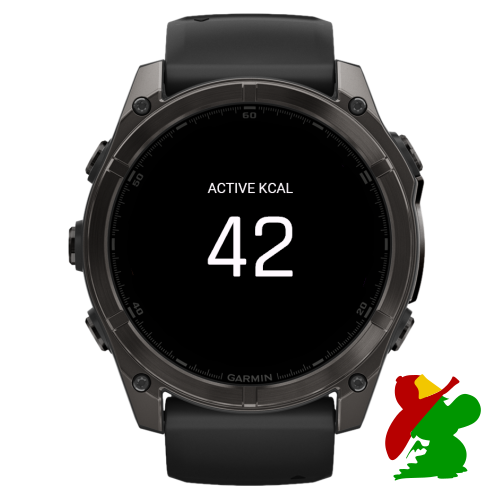

# Active Calories Data Field

Simple data field that calculates your active calories in any activity, allows you to show the calories burned beyond your resting calories during any activity as not all Garmin devices provide an active calories data field. The calculation is based on the the total calories, substracting the [resting calories](https://forums.garmin.com/developer/connect-iq/f/discussion/208338/active-calories/979052?focus=true).

How to add a data field after the installation:

* https://support.garmin.com/en-US/?faq=gyywAozBuAAGlvfzvR9VZ8
* https://www.youtube.com/watch?v=TXjTYmF91g0
